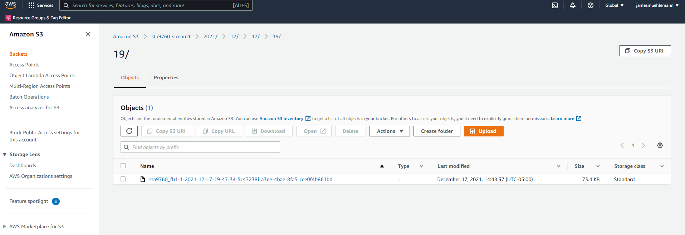
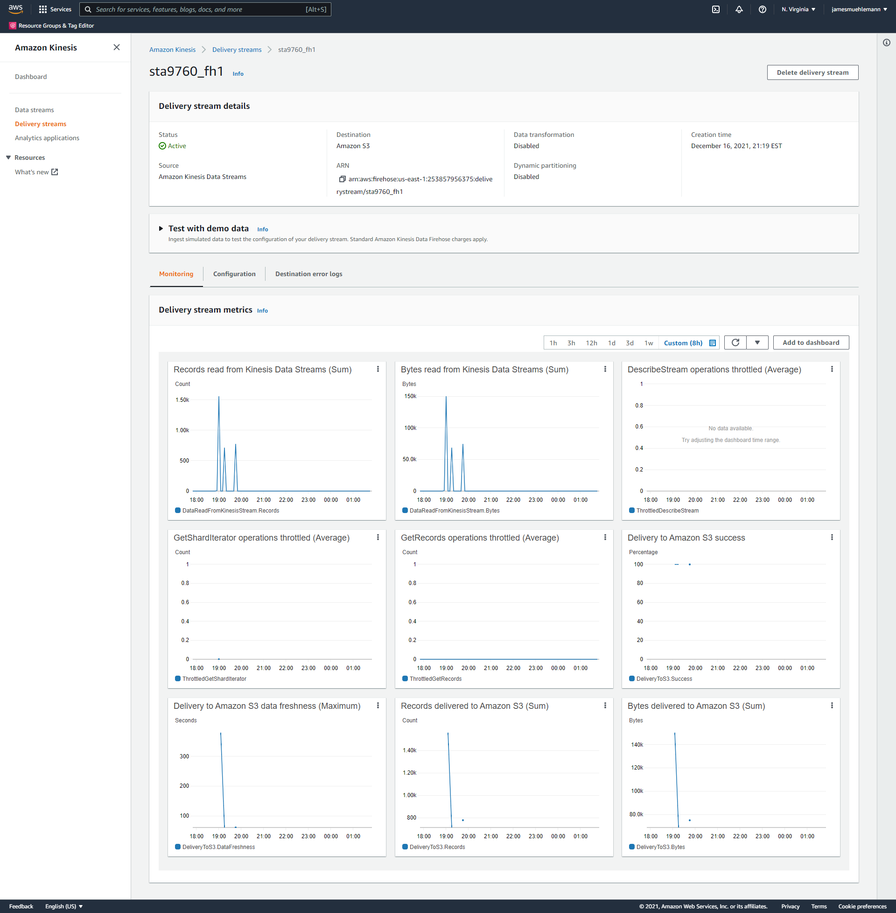

# James Muehlemann - Project 3
## 12.18.21
### Project Overview
 For this project, I was tasked with provisioning a Lambda function to consume near real time finance data, process the data, and dump it in a manner that facilitates querying and further analysis.The technologies I leveraged to complete this project include:
- Python and SQL programming languages
- AWS Lambda
- AWS Kinesis
- AWS Glue
- AWS Athena
- AWS S3

### Infrastructure Elements
|| Step | AWS Technology | Description |
| ------| ------ | ------ | ------ |
|1|Data Transformer| Lambda | Lambda function that gathers the data|
|2|Data Collector| Kinesis; S3|Kinesis stream that holds the data|
3|Data Analyzer| Glue; Athena| Serverless process that allows us to query the S3 data|

### File Hierarchy
| File/Directory | Description |
| ------ | ------ |
| +-- results.csv| CSV File showing results of SQL query
| +-- query.sql| SQL query showing max high and minimum low by hour and time of each high per stock
| +-- data_transformer.py| Python Script used in Lambda function to gather finance data
| +-- Analysis.ipynb| 	Jupyter Notebook of plotting done on SQL query results
|+-- Analysis.pdf | PDF File of finance data analysis
|+-- finance_data.zip| Zip file containing finance data loaded to S3 
|+-- assets/| Folder to hold screenshots
|+-- +-- kinesis_config.png| Screenshot of the delivery stream within Kinesis
|+-- +-- screenshot_of_s3_bucket.png| Screenshot of the S3 bucket with loaded finance data
|+-- README.md| Readme file for Project 3

### S3 Bucket Contents

### Kinesis Configuration

For further questions please contact james.muehlemann@gmail.com